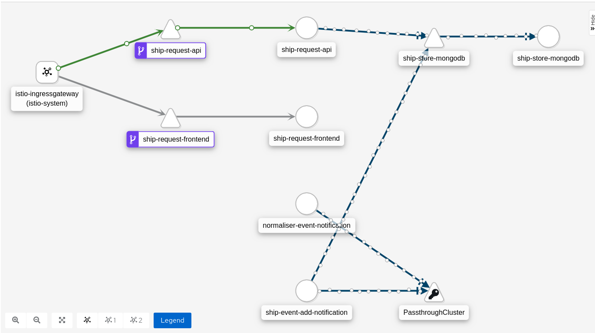

# Investigation into GKE-Knative-Istio functionality

This repository is the outcome of investigating the features and functionalities of:

- Istio
- Knative
- GCP Config Connector
- Jaeger - Kiali and other GUIs

## Fair warning

This codebase will be a bit hacky at times as its mostly proving the viability rather than making a nice implementation.

## Architecture

- [istio-ingressgateway] - Entrance point of the application from the outside world
- [ship-request-api] - Service with readonly access to the database - Put requests not yet implemented (Service is never intended to have write access to db)
- [ship-request-frontend] - Simple static website
- [ship-store-mongodb] - Simple database setup that stores all notifications
- [normaliser-event-notification] - Service that listens to ingress pubsub messages and normalises them
- [ship-event-add-notification] - Service that listens for normalised pubsub messages and enters them into the database - This service has write access and no public interface.

## Standards, Practices, Sidecars & Meshes

In the knativeless version the `normaliser-event-notification` and `ship-event-add-notification` services both use the `pubsub-connector-sidecar` sidecar.
This sidecar handles the integration with gcp pubsub. 

The `normaliser-event-notification` and `ship-event-add-notification` services both follow the [cloudevents spec](https://github.com/cloudevents/spec), to have a standard format for incoming messages.
This means these services work in both the knative and knativeless environments.

The `ship-request-api` service has authentication in-front of its /notifications endpoint, which is managed by istio. This authentication is done in the `ship-request-frontend`.

## Flow

You can send example messages to gcp pubsub by running the ./send.sh command.
The ./send.sh command supports `./send.sh 1` and `./send.sh 2` to send payloads in different formats.

The messages are then picked up by the `normaliser-event-notification` service which publishes the normalised versions back to gcp pubsub.

The normalised messages are then picked up by the `ship-event-add-notification` service which saves the entry to the database.

There is currently no fancy logic within these services other than the specific intended purpose to prove the functionalities of the platform.

## Message Formats

### Un-normalised Message Type 1:

``
{ "version": 1, "id": "1x0d", "name": "Golden Sausage", "captain": "Duke Lordship", "position": "49.2144,2.1312", "speed": { "velocity": 41, "unit": "Knots" } }
``

``
{ "version": 1, "id": "1x0d", "name": "Golden Sausage", "captain": "Duke Lordship", "position": "49.2144,2.1312", "speed": { "velocity": 47, "unit": "Miles" } }
``

### Un-normalised Message Type 2:

``
{ "version": 2, "ship": { "registration": "1x0d", "name": "Golden Sausage" }, "captain": "Duke Lordship", "position": { "latitude": 49.2144, "longitude": 2.1312 }, "speed": 41 }
``

### Normalised Message Type:

``
{ "registration": { "id": "1x0d", "name": "Golden Sausage", "captain": "Duke Lordship" }, "status": { "position": { "lat": 49.2144, "long": 2.1312 }, "velocity": 41 } }
``

## Deployment

You will need to first build all the images, example: `./build.sh ship-request-frontend v1`. The name of the service is the name of the docker file in `deployments/docker`.

There are currently two versions of the application. One with knative and one without.

Choose between `deployments/kubernetes/ship-app-kafka` and `deployments/kubernetes/ship-app-knative`.

At the moment you will probably need to tweak version numbers and some variables unless I make it more generic.

You will probably need to label your namespace like:

- kubectl label namespace ship-app-kafka istio-injection=enabled
- kubectl label namespace ship-app-kafka knative-eventing-injection=enabled # if using knative

## Requirements

- Istio
    - `istioctl manifest apply --set values.kiali.enabled=true --set values.tracing.ingress.enabled=true --set telemetry.enabled=true --set values.tracing.enabled=true  --set values.global.tracer.zipkin.address=jaeger-collector.istio-system:9411`
- Kubernetes
- Knative?
- Jaeger - Kiali?
    - https://www.jaegertracing.io/docs/1.13/operator/
- GCP Config Connector?

